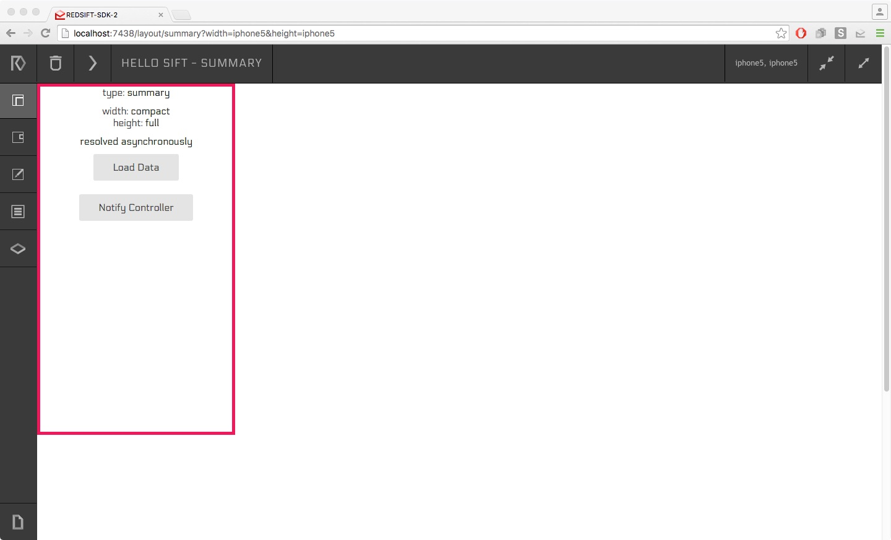
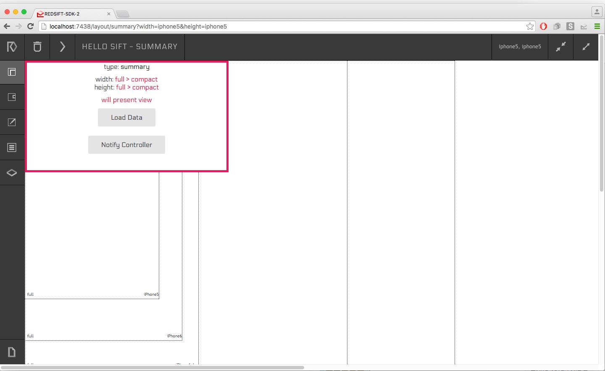

# Building a Sift Guide

This guide walks you through building a Sift from the ground up. We are going to build a Sift that aggregates all the taxi receipts in your Inbox and performs calculations on top of that data set. The purpose of this guide is to familiarize you with the Redsift platform, give you a general overview of the framework and build something concrete at the end. The format of this guide tries to keep explanations brief to make easier the flow of the narration. You can always go deeper in the details in our [docs](https://docs.redsift.io).

Let us start with a short intro to what is a Sift. A Sift is an [isomorphic Javascript application](http://isomorphic.net/javascript) that creates a micro-service on top of your email account(s). Isomorphic, since each Sift has two parts, a *backend* that usually does some data processing in a server and a *frontend* that presents the data in a client. The general flow of a Sift is to get some emails from your inbox, do some processing over that data (e.g. sum, average, map and reduce, etc.) and send it to the client to present them (e.g charts, tables, etc.).

To achieve great results, the first thing we need is good data. That is why this guide at the beginning is data focused. The data processing engine of the Redsift platform is called [Dagger](https://docs.redsift.io/docs#dagger) and it follows the design of a Directed Acyclic Graph. Directed, because data flows from one or multiple inputs to one or multiple outputs. Acyclic, because we wanted to make life easy for us. Graph, because processing units are called `nodes` and we are connecting them with lines. 

The engine is JSON first, configuration, inputs and outputs are all using this format. Each Sift has a **sift.json** file that takes care of all the configuration needed. One of the properties is named `dag` and that is how we configure the Dagger to compute stuff for us, hence we refer to it as DAG. In the DAG we define the `inputs` and the `outputs` of our graph, the `nodes` that take care of the computation and their relationships through `stores`. Each node has an input and some outputs of its own. Data for a node's IO come from the `stores`, which are named places to read and write data once you are inside the Dagger. e.g. We can say that a node _A_ is connected to node _B_, if _A_ writes to store _S_, and _B_ reads from it. A -> S -> B = A -> B 

That's all great for the *backend*, but what is happening with the *frontend*? It follows an MVC like pattern, the only difference is that the Model part is being taken care for you. After finishing with all the data processing in the *backend*, the Redsift platform will handle delivering the data to a local storage medium (e.g. for browsers in IndexedDB). Then data can be introduced to your views by accessing the local storage and by implementing the callbacks provided by the Redsift platform, hooks for when the data is ready and when transitions will take place. Everything else can be a mix of Javascript and HTML which can be added to the _client_ directory of your sift.

Bellow we have the list of steps which you can follow to implement bit by bit the Taxi Sift. Each step builds on top of the previous and at the same trying to introduce a new concept. Besides following them sequentially you can read them in an ad hoc fashion in order to focus on aspects that you are interested in. One file might have multiple versions, since we keep building on top of them and adding code. At the end of each step you can find the full list of files that you need for the specific step. We only insist on following the Hello Sift! example first that takes care of all the needed configuration. Happy Sifting! 

<ol start="0">
  <li> Hello Sift! </li>
  <li><a href="./docs/1-Simple-DAG.md"> Simple DAG </a></li>
  <li><a href="./docs/2-Mapping-Emails.md"> Mapping Emails </a></li>
  <li><a href="./docs/3-Key-Ops.md"> Key Operations </a></li>
  <li><a href="./docs/4-Nested-Filters.md"> Nested Filters </a></li>
  <li><a href="./docs/5-Multiple-Nodes.md"> Multiple Nodes </a></li>
  <li><a href="./docs/6-Aggregating-Results.md"> Aggregating Results </a></li>
  <li><a href="./docs/7-Visualise-Data.md"> Visualise Data </a></li>
  <li><a href="./docs/8-More-Layouts.md"> More Layouts </a></li>
  <li><a href="./docs/9-Update-Views.md"> Updates and Views </a></li>
</ol>

# Hello Sift!

Download the SDK, by opening your terminal and typing: 

`$ curl -sSL https://static-sdk.redsift.io/install | bash`

Create a Sift skeleton by typing:
 
`$ redsift create hello-sift`

This will create a new folder called `hello-sift` with all the files that a Sift needs.

To run the newly created Sift:

`$ redsift run hello-sift`

Open your Chrome browser and go to `http://localhost:7438`. You will see the SDK with the `hello-sift` Sift running. Here is a screen-shot:

You can play around with this default app for a bit before we continue. For example, try to change the `color` property inside the `sift.json` using your favorite text editor. When you save the file, the page in your browser will automatically update and you should be able to see the border colour change. Another thing to try is to click and drag the border of the Sift's viewport. You will immediately see the viewport guidelines like the ones below. 

For each square that appears you can observe, at the low left corner the definition of `size` for Sifts and at the low right corner the name of the device that the dimensions map too. Once you lift your finger from the mouse the border will snap to the closest position. Go ahead and try it!

DISCLAIMER: In this example, we use your email receipts from Uber, Hailo and Addison Lee. Redsift is not affiliated with any of these companies and they do not sponsor or endorse our materials. Product names, logos, brands, and other trademarks featured or referred to within Redsift's products and documentation are the property of their respective trademark holders.
