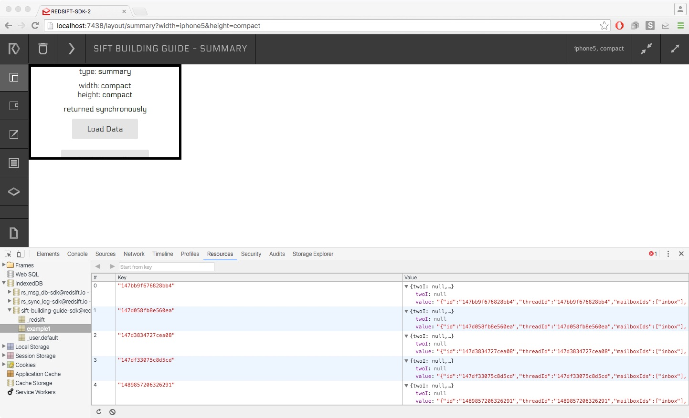

# 1. A Simple DAG

You can follow this tutorial straight out of this repo which builds up from the one created in our _Hello, Sift!_ guide or continue with creating your own following the same steps.

>
To get the most out of this guide you need to have email receipts from one of the following taxi service providers: _AddisonLee_, _Uber_ or _Hailo_. You can still follow the guide, and learn how data flow from one step to the other, even without any data.

**A few things to do before we start:**

Add your email credentials in `email_creds.json`. We are using access tokens, not passwords. You can learn how to acquire yours [here](http://docs.redsift.io/docs/sdk-configuring-email-access).

If you are not using this repo, make sure you copied the implementation that the `dag` property in `sift.json` looks like this:

`"dag":{ "$ref"": "dag1.json"}`

Start the SDK with your sift:

`$ redsift run <PATH TO>/build-taxi-sift-guide/`

or by navigating inside the `build-taxi-sift-guide` folder and doing:

`$ redsift run `

Then with your Chrome browser go to `http://localhost:7438`


## Some emails please


The first thing we need to do is to get some relevant emails from our account. Let's say we want all the receipts from the Hailo taxi company. 
If you have ever used their services you will notice that all their receipts are sent from this email address: _billing@hailocab.com_ We will use that information to create a filter in the `inputs` section of our DAG.

### inputs

What we are saying here is that one of our inputs is going to be from `emails` and we are giving it a name `taxi`. The `taxi` input is filtering data with only one condition: all the emails that come from the _billing@hailocab\\.com_ email address. We need to escape the dot `.`, since this is a regexp.

```
{
  "from": {
    "regexp": {
      "flags": "i",
      "pattern": "billing@hailocab\\.com"
    }
  }
}
```

### node

Nodes that don't have an implementation simply copy their input to their output. 

**Node1** is copying data coming from the DAG's input to the `messages` store.

**Node2** is copying data coming from the store `messages` to the DAG's output `default`.

```
[{
  "#": "node1",
  "input": {
    "bucket": "taxi"
  },
  "outputs": {
    "messages": {}
  }
},{
  "#": "node2",
  "input": {
    "bucket": "messages"
  },
  "outputs": {
    "example1":{}
  }
}]
```

### stores

We defined one store named `messages` with a `key$schmema` set to `string`.

```
{
  "messages": {
    "key$schema": "string"
  }
}
```

### outputs

We want to export the data from the DAG, so we defined an `exports` type of output and it has one output defined called `default`. An ObjectStore with the name `default` will be created in the appropriate database of IndexedDB.

```
{
  "exports":{
    "example1":{
      "key$schema":"string"
    }
  }
}
```
## Did we get any data?

In your Chrome browser and in the SDK tab:

Press the arrow button in the top right corner to start processing your emails.

Then go to View > Developer > Javascript Console

Click on the Resources tab and then on IndexedDB.

You should see some data like below:



If you don't see something try refreshing IndexedDB by right clicking on it.
You can see the newly created `example1` with all our data that we defined in your DAG.

## Files

**dag1.json**


