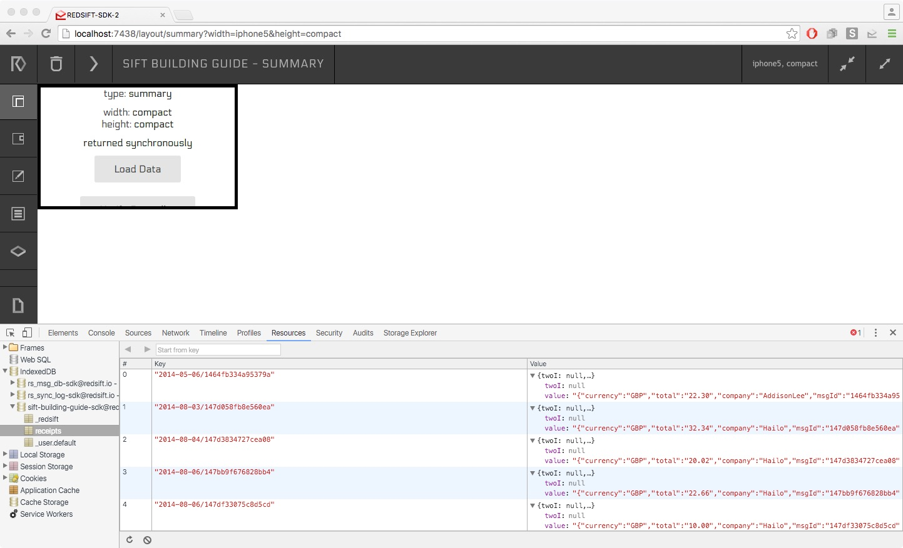

# 2. Mapping Emails

Please edit your `sift.json` file to look like this:

`"dag": { "$ref":"./dag2.json" }`


In this step we are going to look for emails from two providers, from _Hailo_ or _Addison Lee_ and we are going to add an intermediate node that is going to perform a `map` operation over our data.

## More email sources and mapping properties

### inputs

This time we have two conditions that are connected with the `OR` operator. The one for Hailo is the same as before. The new one is for Addison Lee and tries to filter emails based on their subject using the following pattern `.*Addison Lee Booking`.

```
"filter": {
  "conditions": [{
    "from": {
      "regexp": {
        "flags": "i",
        "pattern": "billing@hailocab\\.com"
      }
    }
  },{
    "subject": {
      "regexp": {
        "flags": "i",
        "pattern": ".*Addison Lee Booking"
      }
    }
  }],
  "operator": "OR"
}
```

### nodes

We have a new node that is called `Messages mapper`. 

It has an implementation which is located in the file `server/map1.js`.

Input is coming directly from the `taxi` input. Since we are not performing any key operations we can get our inputs directly from the DAG inputs. So, for this step we skipped the `node1` we created in the first step. We are going to bring it back in the next step for a key selection.

Output is to receipts which later on is going to be a `store` for the DAG but for now we are exporting it so we can observe the new layout of our data.

```
[{
  "#": "Messages mapper",
  "implementation": {
      "node": "server/map1.js"
  },
  "input": {
      "bucket": "taxi"
  },
  "outputs": {
      "receipts": {}
  }
}]
```

### implementations

This is the first time we supply an implementation for a node. What we are trying to achieve here is to look through the text of the email for a text extract that looks something like `Total: £34.50`. We use a regexp pattern to first find a match in the preview of the email and if that fails we continue for a full scan of the body of the email. When we find what we are looking for, all we are doing is creating a JSON object with a `name`, `key` and `value` and push it to the array `ret` we are going to return once we are done with all the emails.

Below you can see an extract of the actual implementation trying to highlight the important bits. The full implementation can be found a bit lower. 

>
Hint: you will need to install the dependency `string` with npm before trying to execute it.

```
...
function(got) {
  const inData = got['in'];
  var ret = [];
  for(var d of inData.data) {
    var msg = JSON.parse(d.value);

    // Use a regexp to look for the word 'total' inside the preview of the email
    var tot = TaxiRegExp.TOTAL.exec(msg.preview);
    if(!tot) {
      const msgBody = msg.textBody || msg.htmlBody;
      const sBody = S(msgBody).stripTags().s.replace(HTMLRegExp.CLEANUP, '');
      // Try once again using the mssage body in case info not in preview
      tot = TaxiRegExp.TOTAL.exec(sBody);
    }
    
    // If found total and managed to extract value from it
    if(tot && tot.length === 3) {
      var currency = 'USD';
      var val = tot[2];
      var company = msg.from.name.toLowerCase();
      var date = new Date(msg.date);
      
      ...
      // check for the correct currency label
      ...
      // check for the correct company
      ...

      ret.push({
        name: 'receipts', 
        key:  yyyymmdd(date, '-') + '/' + msg.id, 
        value: {
          currency: currency, 
          total: val, 
          company: company, 
          msgId: msg.id, 
          threadId: msg.threadId, 
          date: date
        }
      });
    }
  }
  return ret;
}
```

### outputs

We made `receipts` a DAG `output` for now since there is no other node using it, but we are going to use it as a `store` later on.

```
"exports":{
  "receipts":{
    "key$schema":"string/string"
  }
}
```

## What does it look like now?

Since we changed our DAG quite a bit we need to delete our local storage first. Press the big black button `DELETE DBS`.

Then run again your DAG from the terminal like we did in the first step with:

`$ redsift run-dag <PATH TO>/build-taxi-sift-guide/sift.json`

Look for `receipts` now in your IndexedDB:



You can see now that your data have a completely different structure. 

Each row has a key that looks like the `key$schema` we defined(`string/string`) and its value has some real data with a `total`,`currency`,`msgId`, etc. fields.


## Files

**dag2.json**

**server/map1.js**
