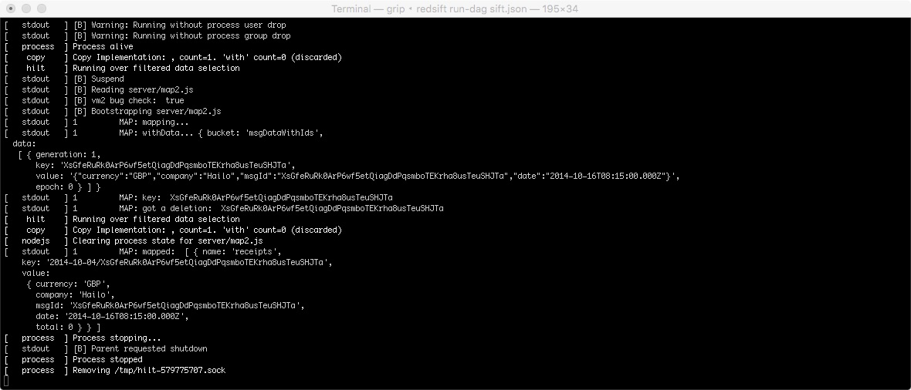

# 3. Key Operations

Please edit your `sift.json` file to look like this:

`"dag": { "$ref":"./dag3.json" }`

## Using `with` in nodes.

In this example we are focusing on a node that performs a join operation over two inputs sources using the `with` property and outputs data to a `store` that is also using it as an input. 


### nodes

We are extending the `Messages mapper` node from the previous example. It now performs a join over `messages` and `msgDataWithIds` by using the `$hash` anchor. The `select` fields are used effectively as the two sides of the relationship you would expect after the `ON` operator in a regular SQL JOIN operation. The value `$hash` in each of them essentially translates to try and match the entirety of the key coming from each side.

When we have a match the `with` property in the arguments of the implementation function, will be populated.

Another new thing, in this node is the fact that it has two outputs. This is possible with the use of the `name` field in each of the JSON objects that our implementation emits.

The last interesting bit here, is the cycle back of data from the node's outputs to its input. The trick here is that this will happen at a later stage. First the node will compute as if it had only one input and when data become available in the second input the node will be triggered again for a new computation. In this particular case we are using it to remove the value of a deleted email from our calculations.

We brought back `node1` as an intermediate step since we are performing a key operation over our node's inputs and we are restricted from using directly a DAG `input`.

The addition of nodes `node2` and `node3` is meant to enhance this example by observing their output, and have no value in our computation process.

```
[{
  "#": "node1",
  "input": {
    "bucket": "taxi"
  },
  "outputs": {
    "messages": {}
  }
},{
  "#": "Messages mapper",
  "implementation": {
    "javascript": "server/map2.js"
  },
  "input": {
    "bucket": "messages",
    "select": "$hash",
    "with": {
      "bucket": "msgDataWithIds",
      "select": "$hash"
    }
  },
  "outputs": {
    "msgDataWithIds": {},
    "receipts": {}
  }
},{
  "#": "node2",
  "input": {
    "bucket": "receipts"
  },
  "outputs": {
    "outReceipts":{}
  }
},{
  "#": "node3",
  "input": {
    "bucket": "msgDataWithIds"
  },
  "outputs": {
    "outMsgDataWithIds":{}
  }
}]
```

### implementation 

The implementation is pretty much the same as before with two differences:

* we are now emitting events to a second store as per the definition of our node above

```
...
ret.push({
      name: 'msgDataWithIds', 
      key:  d.key, 
      value: {
        currency: currency, 
        company: company, 
        msgId: msg.id, 
        date: date
    }
});
...
```

* We are addressing an extra case in our code, when we receive an input event without a value. 
Usually, that happens when an email gets deleted and triggers an event for the DAG to compute again. To simulate that during development we can delete one of the files inside the _messages_ directory. It can be found at:
&lt;siftDir&gt;/sdk_runs/&lt;latestCreatedFile&gt;/&lt;nameOfDagEmailInput&gt;/messages

### outputs

A couple of dummy outputs just to be able to observe the data in our stores.

```
"exports":{
  "outReceipts":{
    "key$schema":"string/string"
  },
  "outMsgDataWithIds":{
    "key$schema": "string"
  }
}
```


### stores

We moved `receipts` from the DAG `outputs` section to `stores` and added `messages` and `msgDataWithIds`.

```
"stores": {
  "messages": {
    "key$schema": "string"
  },
  "receipts": {
      "key$schema": "string/string"
  },
  "msgDataWithIds": {
      "key$schema": "string"
  }
}
```

## Want to see some action?

As always, when you make changes in the `exports` section you need to delete your local storage and run again your DAG.

If you observe the dbs created in IndexedDB nothing has changed from a data perspective, just their names.

The difference now is that we are ready to process deletions. Let's simulate that!

First restart the SDK process with the addition of the watch flag `-w`. The command will look like:

`redsift run -w` (+ `<PATH TO SIFT FOLDER>`)

The watch flag gives us the ability to simulate in the SDK new emails arriving or deleting old ones. All is done by watching the appropriate folder we store the JMAP represantation of the emails we pulled based on our filters.

Now to simulate a deletion, in a new terminal do the following:

1. Press the arrow button to run your DAG.

2. `$ cd <PATH TO>/build-taxi-sift-guide/sdk_runs`

3. ``$ cd `ls -td -- */ | head -n 1`; cd taxi/messages``  (this is just a one liner to find the latest created folder, and then navigate inside it.)

4. now delete any file while keeping an eye at the output in the terminal the SDK is running. You should something like the following coming out.




We received some data in the `with` property of the argument for `map2.js`. That means that our join had a match, so the node was triggered for recomputation.

## Files

**dag3.json**

**server/map2.json**