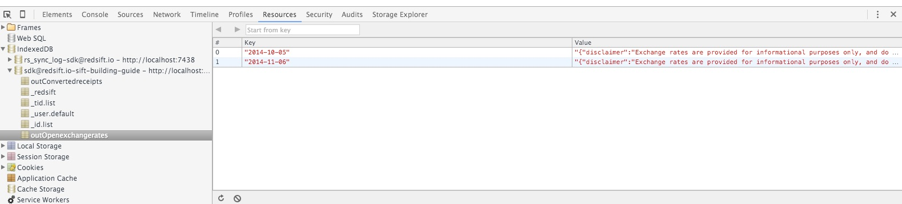
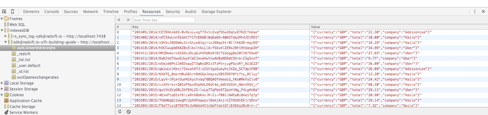

# 5. Multiple Nodes

Please edit your `sift.json` file to look like this:

`"dag": { "$ref":"./dag5.json" }`

Head to [openexchangerates](http://openexchangerates.org) to get your own personal key for this step to work. It's simple and free. Once you get it edit the `oxrAppId` with it.

## Currency Converter

For this step we are adding  a new computational step in our DAG, which will convert all the receipts we have no matter the currency they are in, in the currency of our preference using the exchange rate of the date our trip took place.

### nodes

Our new node is named `Currency Converter` and we supply an implementation with the _currency.js_ file. It has multiple outputs both to `stores` and `exports`, but the most interesting part is the input section. It uses the `with` property as we have seen before, but this time we are performing an operation on the key of the `receipts` store. We are splitting it to two parts, an anchor `$day` which we want to keep and everything else that comes after it. The `$day` anchor from `receipts` is going to be used for the join with the `openexchangerates` store.

```
{
  "#": "Currency converter",
  "implementation": {
    "node": "server/currency.js"
  },
  "input": {
    "bucket": "receipts",
    "select": "$day/*",
    "with": {
      "bucket": "openexchangerates",
      "select": "$day"
    }
  },
  "outputs": {
    "convertedreceipts": {},
    "openexchangerates": {},
    "idList": {},
    "tidList": {}
  }
}
```

### stores

We added the new stores that we need.

```
"stores": {
  ...,
  "convertedreceipts": {
    "key$schema": "string/string/string"
  },
  "openexchangerates": {
    "key$schema": "string"
  }
}
```

### outputs

After adding the `out*` exports just so we can export the new stores we created, comes the interesting part of the `idList` and `tidList` exports which have an `import` field. 
The convention here is that names that start with an underscore `_` are restricted and are meant only for system usage. With that said if we `import` a system bucket ( referring to an ObjectStore in indexedDB ) and follow the key convention we can write some information that can be used later in the Chrome extension when we want to do lookups on a per email or thread id, hence the names `_id.list` and `_tid.list` respectively.

```
"outputs":{
  "exports":{
    "idList": {
      "import": "_id.list"
    },
    "tidList": {
      "import": "_tid.list"
    },
    "outConvertedreceipts":{
      "key$schema": "string/string/string"
    },
    "outOpenexchangerates":{
      "key$schema": "string"
    }
  }
}
```

### implementation

The implementation that we provided for the `Currency converter` node might seem lengthier than the previous one but it's quite simple. We perform a request to the openexchangerates API and the result of that request we put in the `openexchangerates` store so we can use it later to avoid constant requests to the API.

Next we convert the receipts in different currencies with the help of the base rate that we got from the exchange service. Then we emit them to the `convertedReceipt` store and to the two exports `idList` and `tidList`, one with the `emailId` key and the other with the `threadId` key.

> Note: You will need to install two more dependencies using `npm` for the implementation to work, `request-promise` and `money`.

## State of local storage

If you look inside IndexedDB this time you should be able to find four databases: `_id.list`, `_tid.list`, `outConvertedreceipts` and `outOpenexchangerates`.


The `openexchangerates` is used as a cache inside the DAG, so we avoid unnecessary requests to the external API. So the `outOpenexchangerates` has the responses we got from the API for each day.



Here we can see what the receipts look like before we try to aggregate them.


Lastly, the `_id.list` and `_tid.list` dbs, follow the convention of having as a key the `messageId` of an email and the `threadId` an email belongs too respectively. The data stored in those dbs, will be imported by the framework if the Sift implements the `list` view.
TODO example

## Full

**dag5.json**

**server/currency.js**